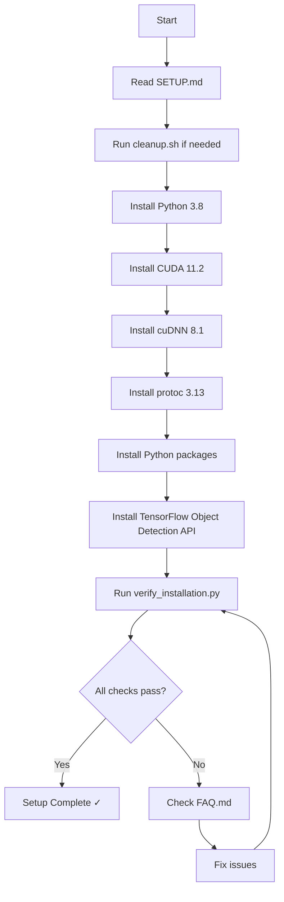
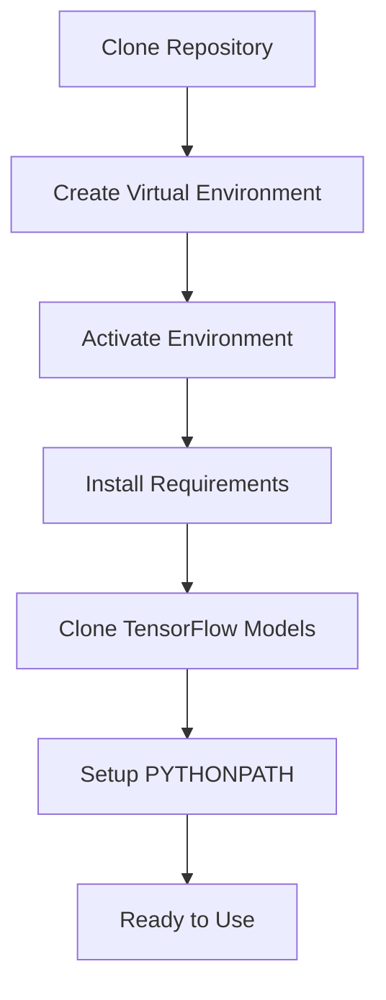
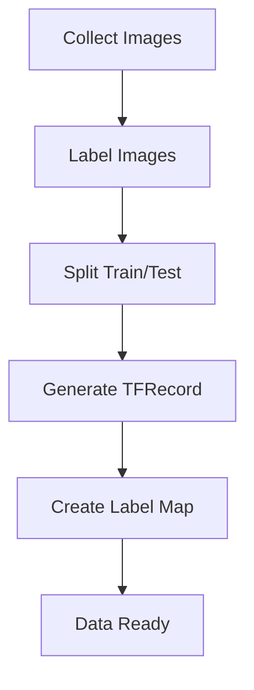
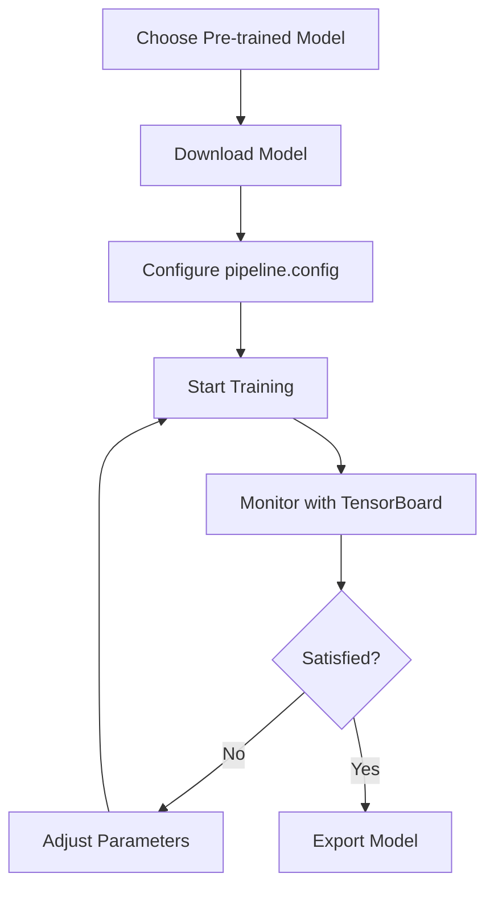
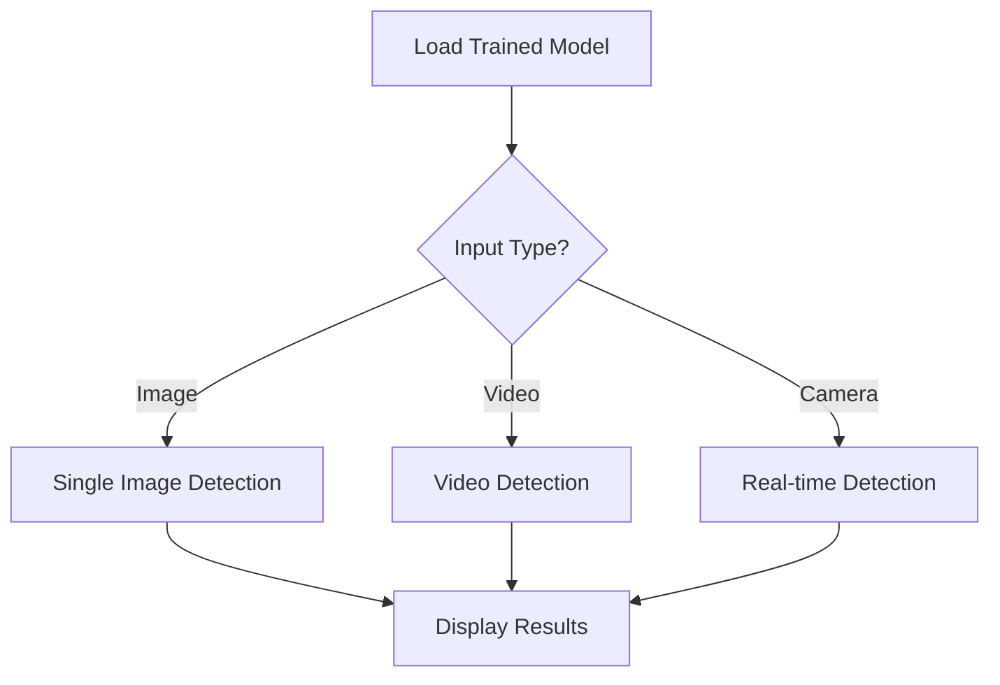
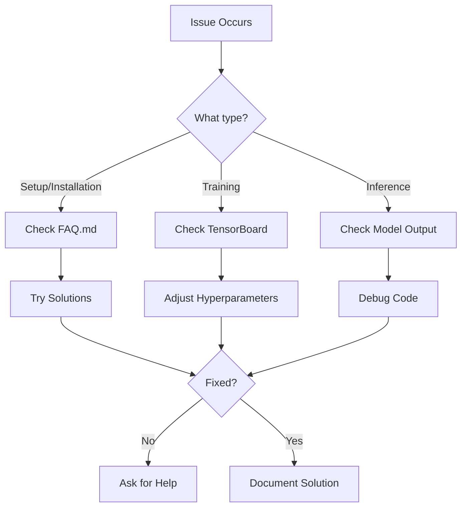

# Project Structure and Workflow

## 📁 Repository Structure

```
RealTimeObjectDetection/
│
├── 📄 README.md                    # Project overview and quick start
├── 📄 SETUP.md                     # Comprehensive setup guide
├── 📄 FAQ.md                       # Frequently asked questions
├── 📄 QUICK_REFERENCE.md           # Quick command reference
├── 📄 WORKFLOW.md                  # This file - workflow guide
├── 📄 requirements.txt             # Python package dependencies
│
├── 🔧 cleanup.sh                   # Environment cleanup script
├── 🔧 verify_installation.py      # Installation verification script
│
├── 📓 Tutorial.ipynb               # Step-by-step tutorial notebook
│
└── 📂 Tensorflow/
    ├── 📂 scripts/
    │   └── generate_tfrecord.py   # TFRecord generation script
    │
    └── 📂 workspace/
        ├── 📂 annotations/        # Label maps, TFRecord files
        ├── 📂 images/             # Training and test images
        │   ├── train/            # Training images
        │   └── test/             # Test images
        ├── 📂 models/             # Your trained models
        │   └── my_ssd_mobnet/    # Example model directory
        │       ├── pipeline.config
        │       ├── checkpoint/
        │       └── export/
        └── 📂 pre-trained-models/ # Downloaded pre-trained models
```

## 🚀 Complete Workflow

### Phase 1: Environment Setup



**Commands:**
```bash
# 1. Clean existing setup (if needed)
bash cleanup.sh

# 2. Follow SETUP.md for installation

# 3. Verify installation
python verify_installation.py

# 4. If issues, check FAQ.md
```

### Phase 2: Project Setup



**Commands:**
```bash
# 1. Clone this repository
git clone https://github.com/tja111/RealTimeObjectDetection.git
cd RealTimeObjectDetection

# 2. Activate your virtual environment
source ~/tf_object_detection/bin/activate

# 3. Install project requirements
pip install -r requirements.txt

# 4. Clone TensorFlow models (if not already done)
cd ~
git clone https://github.com/tensorflow/models.git

# 5. Start Jupyter
jupyter notebook Tutorial.ipynb
```

### Phase 3: Data Collection and Preparation



**Steps:**
1. **Collect Images**: 
   - Take photos or download dataset
   - Aim for 100+ images per class
   - Diverse backgrounds and angles

2. **Label Images**:
   - Use LabelImg tool
   - Save annotations in PASCAL VOC or COCO format
   - Place in `Tensorflow/workspace/images/train/` and `test/`

3. **Generate TFRecord**:
   ```bash
   python Tensorflow/scripts/generate_tfrecord.py \
       -x Tensorflow/workspace/images/train \
       -l Tensorflow/workspace/annotations/label_map.pbtxt \
       -o Tensorflow/workspace/annotations/train.record
   
   python Tensorflow/scripts/generate_tfrecord.py \
       -x Tensorflow/workspace/images/test \
       -l Tensorflow/workspace/annotations/label_map.pbtxt \
       -o Tensorflow/workspace/annotations/test.record
   ```

### Phase 4: Model Training



**Steps:**
1. **Choose Model**:
   - Fast: SSD MobileNet V2
   - Accurate: Faster R-CNN ResNet50
   - Balanced: EfficientDet

2. **Configure**:
   Edit `pipeline.config`:
   - Set paths to TFRecord files
   - Set path to label map
   - Set batch size based on GPU memory
   - Set number of classes

3. **Train**:
   ```bash
   cd ~/models/research
   python object_detection/model_main_tf2.py \
       --model_dir=Tensorflow/workspace/models/my_ssd_mobnet \
       --pipeline_config_path=Tensorflow/workspace/models/my_ssd_mobnet/pipeline.config
   ```

4. **Monitor**:
   ```bash
   tensorboard --logdir=Tensorflow/workspace/models/my_ssd_mobnet
   ```

5. **Export**:
   ```bash
   python object_detection/exporter_main_v2.py \
       --input_type=image_tensor \
       --pipeline_config_path=Tensorflow/workspace/models/my_ssd_mobnet/pipeline.config \
       --trained_checkpoint_dir=Tensorflow/workspace/models/my_ssd_mobnet \
       --output_directory=Tensorflow/workspace/models/my_ssd_mobnet/export
   ```

### Phase 5: Inference and Deployment



**Example Code**:
```python
import tensorflow as tf
import cv2
import numpy as np
from object_detection.utils import label_map_util
from object_detection.utils import visualization_utils as viz_utils

# Load model
detect_fn = tf.saved_model.load('path/to/exported/model/saved_model')

# Load label map
category_index = label_map_util.create_category_index_from_labelmap(
    'path/to/label_map.pbtxt'
)

# Real-time detection
cap = cv2.VideoCapture(0)
while True:
    ret, frame = cap.read()
    input_tensor = tf.convert_to_tensor([frame])
    detections = detect_fn(input_tensor)
    
    # Visualize
    viz_utils.visualize_boxes_and_labels_on_image_array(
        frame,
        detections['detection_boxes'][0].numpy(),
        detections['detection_classes'][0].numpy().astype(np.int32),
        detections['detection_scores'][0].numpy(),
        category_index,
        use_normalized_coordinates=True,
        max_boxes_to_draw=20,
        min_score_thresh=0.5
    )
    
    cv2.imshow('Object Detection', frame)
    if cv2.waitKey(1) & 0xFF == ord('q'):
        break

cap.release()
cv2.destroyAllWindows()
```

## 📊 Development Checklist

### Initial Setup
- [ ] Read README.md and SETUP.md
- [ ] Clean existing installations (if applicable)
- [ ] Install all dependencies
- [ ] Verify installation with verify_installation.py
- [ ] Clone TensorFlow models repository
- [ ] Test GPU with nvidia-smi

### Data Preparation
- [ ] Collect images for each class (100+ recommended)
- [ ] Label images using LabelImg or similar tool
- [ ] Split data into train (80%) and test (20%)
- [ ] Create label_map.pbtxt
- [ ] Generate TFRecord files for train and test sets
- [ ] Verify TFRecord files are created correctly

### Model Training
- [ ] Choose and download pre-trained model
- [ ] Extract model to pre-trained-models/
- [ ] Copy pipeline.config to models/my_model/
- [ ] Update pipeline.config with correct paths
- [ ] Set number of classes in config
- [ ] Set appropriate batch size for your GPU
- [ ] Start training
- [ ] Monitor training with TensorBoard
- [ ] Save checkpoints regularly

### Evaluation and Export
- [ ] Evaluate model on test set
- [ ] Check precision and recall metrics
- [ ] Export model for inference
- [ ] Test exported model on sample images
- [ ] Test on video if needed
- [ ] Test real-time detection with webcam

### Deployment (Optional)
- [ ] Optimize model for inference (TensorRT, quantization)
- [ ] Create standalone inference script
- [ ] Document model usage
- [ ] Package model for distribution
- [ ] Deploy to target platform

## 🎯 Common Tasks

### Quick Reference
```bash
# Activate environment
source ~/tf_object_detection/bin/activate

# Check GPU
nvidia-smi

# Start Jupyter
jupyter notebook

# Monitor GPU during training
nvidia-smi -l 1

# View TensorBoard
tensorboard --logdir=Tensorflow/workspace/models/

# Check Python packages
pip list | grep -E "tensorflow|opencv"

# Update pip packages
pip install --upgrade tensorflow opencv-python
```

### Useful Links
- [TensorFlow Model Zoo](https://github.com/tensorflow/models/blob/master/research/object_detection/g3doc/tf2_detection_zoo.md)
- [LabelImg Tool](https://github.com/tzutalin/labelImg)
- [TensorFlow Object Detection API](https://github.com/tensorflow/models/tree/master/research/object_detection)
- [Training Custom Object Detector](https://tensorflow-object-detection-api-tutorial.readthedocs.io/en/latest/training.html)

## 📈 Tips for Success

1. **Start Small**: Test with a small dataset first to verify everything works
2. **Monitor Resources**: Watch GPU memory and temperature
3. **Save Frequently**: Training can take hours - don't lose progress
4. **Version Control**: Use git to track your configurations
5. **Document Changes**: Keep notes on what works and what doesn't
6. **Use TensorBoard**: Visualize training progress in real-time
7. **Test Incrementally**: Test each phase before moving to the next
8. **Backup Models**: Save your trained models regularly

## 🐛 Debugging Workflow



**Debugging Checklist:**
1. Check error message carefully
2. Verify GPU is being used (nvidia-smi)
3. Check file paths are correct
4. Verify data format is correct
5. Check available disk space and memory
6. Review logs and TensorBoard
7. Test with minimal example
8. Search FAQ.md and online resources
9. Ask for help with detailed information

## 🎓 Learning Path

1. **Beginner**: 
   - Complete environment setup
   - Run Tutorial.ipynb
   - Train on sample dataset
   - Test inference

2. **Intermediate**:
   - Collect custom dataset
   - Train custom model
   - Evaluate and optimize
   - Deploy for real-time use

3. **Advanced**:
   - Experiment with different architectures
   - Implement data augmentation
   - Optimize for speed/accuracy
   - Deploy on edge devices

---

*This workflow guide is designed to help you navigate the complete process from setup to deployment. Follow each phase in order for the best results.*

**Need help?** Check [FAQ.md](FAQ.md) or open an issue on GitHub.
